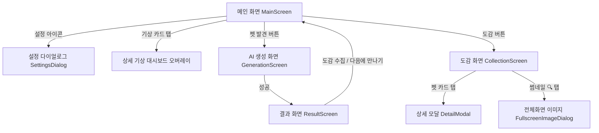

# 펫 메이커 (Pet Maker) 기능 명세서 (마스터)

이 문서는 **펫 메이커(Pet Maker)** 프로젝트의 핵심 기능 목록을 기능 요구사항(FR) ID에 대입하여 기능별 코드 구조, 동작 흐름, UI 요소 및 관련 소스 파일과 매핑하여 기술합니다. 각 세부 기능에 대한 개별 문서 파일도 링크를 통해 열람할 수 있습니다.

---

## 1. 프로젝트 주요 화면 및 기능 구조

전체 애플리케이션은 Jetpack Compose와 Navigation Component를 활용하여 유기적으로 연결된 4개의 주 화면과 설정 및 세부 정보 모달 창으로 구성되어 있습니다.

---

## 2. 기능별 세부 명세 및 기술적 구현 방식

*각 항목명을 클릭하면 해당 기능의 단독 명세 문서로 연결됩니다.*

### 📄 [f01-실시간 환경 정보 수집 및 표시](file:///c:/Users/User/Documents/Mobile/features/f01_realtime_environment.md)
- **관련 요구사항**: `FR-01`
- **관련 파일**: [MainActivity.kt](file:///c:/Users/User/Documents/Mobile/PetMaker/app/src/main/java/com/example/petmaker/MainActivity.kt), [MainScreen.kt](file:///c:/Users/User/Documents/Mobile/PetMaker/app/src/main/java/com/example/petmaker/ui/screens/MainScreen.kt), [WeatherApi.kt](file:///c:/Users/User/Documents/Mobile/PetMaker/app/src/main/java/com/example/petmaker/data/remote/WeatherApi.kt)
- **동작 설명**: 사용자는 메인 화면에서 현재 위치의 날씨, 기온, 시간대, 초 단위 시간 정보를 직관적인 UI로 확인합니다.
- **상세 명세**: [f01_realtime_environment.md](file:///c:/Users/User/Documents/Mobile/features/f01_realtime_environment.md)에서 더 자세한 런타임 수집 로직을 확인할 수 있습니다.

### 📄 [f02-환경 기반 펫 생성 가능 여부 판정](file:///c:/Users/User/Documents/Mobile/features/f02_pet_generation_trigger.md)
- **관련 요구사항**: `FR-02`
- **관련 파일**: [MainScreen.kt](file:///c:/Users/User/Documents/Mobile/PetMaker/app/src/main/java/com/example/petmaker/ui/screens/MainScreen.kt)
- **동작 설명**: 시스템은 실시간 환경 데이터가 획득된 상태에서 내부 주기 판정을 통해 50% 확률로 펫 발견 알림 및 생성 진입 버튼을 노출합니다.
- **상세 명세**: [f02_pet_generation_trigger.md](file:///c:/Users/User/Documents/Mobile/features/f02_pet_generation_trigger.md)에서 펄스 애니메이션 및 확률 체크 코루틴 구조를 확인할 수 있습니다.

### 📄 [f03-AI 기반 고유 펫 생성](file:///c:/Users/User/Documents/Mobile/features/f03_ai_pet_creation.md)
- **관련 요구사항**: `FR-03`
- **관련 파일**: [GenerationScreen.kt](file:///c:/Users/User/Documents/Mobile/PetMaker/app/src/main/java/com/example/petmaker/ui/screens/GenerationScreen.kt), [GeminiApi.kt](file:///c:/Users/User/Documents/Mobile/PetMaker/app/src/main/java/com/example/petmaker/data/remote/GeminiApi.kt), [ResultScreen.kt](file:///c:/Users/User/Documents/Mobile/PetMaker/app/src/main/java/com/example/petmaker/ui/screens/ResultScreen.kt), [PetAnimations.kt](file:///c:/Users/User/Documents/Mobile/PetMaker/app/src/main/java/com/example/petmaker/ui/components/PetAnimations.kt)
- **동작 설명**: 펫 생성 시, 수집된 환경 정보(위치, 기온, 날씨, 시간대)를 AI에 주입하여 고유한 펫 프로필 정보(이름, 성격, 특징 설명 등)를 획득하고 연출 효과를 노출합니다.
- **상세 명세**: [f03_ai_pet_creation.md](file:///c:/Users/User/Documents/Mobile/features/f03_ai_pet_creation.md)에서 Gemini AI 프롬프트 스키마 및 별가루 파티클 애니메이션 기법을 확인할 수 있습니다.

### 📄 [f04-펫 수집 및 영구 저장](file:///c:/Users/User/Documents/Mobile/features/f04_pet_collection_save.md)
- **관련 요구사항**: `FR-04`
- **관련 파일**: [ResultScreen.kt](file:///c:/Users/User/Documents/Mobile/PetMaker/app/src/main/java/com/example/petmaker/ui/screens/ResultScreen.kt), [PetEntity.java](file:///c:/Users/User/Documents/Mobile/PetMaker/app/src/main/java/com/example/petmaker/data/local/PetEntity.java), [PetDao.java](file:///c:/Users/User/Documents/Mobile/PetMaker/app/src/main/java/com/example/petmaker/data/local/PetDao.java), [PetDatabase.java](file:///c:/Users/User/Documents/Mobile/PetMaker/app/src/main/java/com/example/petmaker/data/local/PetDatabase.java)
- **동작 설명**: 사용자는 발견된 펫을 선택해 로컬 파일 및 DB에 영구히 소장할 수 있으며, 소장하지 않고 즉시 자연으로 돌려보낼 수 있습니다.
- **상세 명세**: [f04_pet_collection_save.md](file:///c:/Users/User/Documents/Mobile/features/f04_pet_collection_save.md)에서 로컬 I/O 파일 복사 처리 및 Room 트랜잭션을 확인할 수 있습니다.

### 📄 [f05-펫 도감 열람 및 상세 정보 확인](file:///c:/Users/User/Documents/Mobile/features/f05_pet_book_details.md)
- **관련 요구사항**: `FR-05`
- **관련 파일**: [CollectionScreen.kt](file:///c:/Users/User/Documents/Mobile/PetMaker/app/src/main/java/com/example/petmaker/ui/screens/CollectionScreen.kt), [DetailModal.kt](file:///c:/Users/User/Documents/Mobile/PetMaker/app/src/main/java/com/example/petmaker/ui/screens/DetailModal.kt)
- **동작 설명**: 사용자는 도감 화면에서 자신이 이제껏 모은 모든 펫의 목록(이름, 날짜, 특성 요약 등)을 관찰할 수 있으며, 카드 클릭 시 상세 프로필 팝업이 노출됩니다.
- **상세 명세**: [f05_pet_book_details.md](file:///c:/Users/User/Documents/Mobile/features/f05_pet_book_details.md)에서 Flow 갱신 스케줄, 상세 프로필 다이얼로그 구성을 확인할 수 있습니다.

### 📄 [f06-날씨별 배경 애니메이션](file:///c:/Users/User/Documents/Mobile/features/f06_weather_animations.md)
- **관련 요구사항**: `FR-06`
- **관련 파일**: [WeatherBackground.kt](file:///c:/Users/User/Documents/Mobile/PetMaker/app/src/main/java/com/example/petmaker/ui/components/WeatherBackground.kt)
- **동작 설명**: 시스템은 실시간 기상 상태에 따라 뒷배경에 다채로운 날씨 테마 컬러 그라디언트를 연출하고 특수 기상 애니메이션(빗방울, 눈송이)을 가동합니다.
- **상세 명세**: [f06_weather_animations.md](file:///c:/Users/User/Documents/Mobile/features/f06_weather_animations.md)에서 Canvas 입자 물리 드로잉 및 지그재그 흔들림 눈송이 구현 기법을 확인할 수 있습니다.

### 📄 [f07-지도 기반 위치 표시 (예정)](file:///c:/Users/User/Documents/Mobile/features/f07_map_integration.md)
- **관련 요구사항**: `FR-07`
- **동작 설명**: Google Maps API 지도 연동을 통해 사용자의 실시간 GPS 위치 마킹과 주변 펫 생성 범위 시각화 및 반경 진입 감지를 목표로 기획되었습니다.
- **상세 명세**: [f07_map_integration.md](file:///c:/Users/User/Documents/Mobile/features/f07_map_integration.md)에서 차기 지도 연동 설계 요소를 확인할 수 있습니다.

### 📄 [f08-API Key 안전 관리 및 설정 기능](file:///c:/Users/User/Documents/Mobile/features/f08_api_key_management.md)
- **관련 요구사항**: `FR-08`
- **관련 파일**: [SettingsDialog.kt](file:///c:/Users/User/Documents/Mobile/PetMaker/app/src/main/java/com/example/petmaker/ui/components/SettingsDialog.kt), [ApiKeyManager.kt](file:///c:/Users/User/Documents/Mobile/PetMaker/app/src/main/java/com/example/petmaker/data/local/ApiKeyManager.kt)
- **동작 설명**: 외부 연동용 인증 키들을 텍스트 창에 직접 입력하고 저장할 수 있는 다이얼로그 기능입니다.
- **상세 명세**: [f08_api_key_management.md](file:///c:/Users/User/Documents/Mobile/features/f08_api_key_management.md)에서 SharedPreferences 안전 적재 및 암호 토글 UI 구현을 확인할 수 있습니다.

### 📄 [f09-펫 이미지 수집 및 자동 폴백 시스템](file:///c:/Users/User/Documents/Mobile/features/f09_image_generation_fallback.md)
- **관련 요구사항**: `FR-09`
- **관련 파일**: [GenerationScreen.kt](file:///c:/Users/User/Documents/Mobile/PetMaker/app/src/main/java/com/example/petmaker/ui/screens/GenerationScreen.kt), [FluxApi.kt](file:///c:/Users/User/Documents/Mobile/PetMaker/app/src/main/java/com/example/petmaker/data/remote/FluxApi.kt)
- **동작 설명**: 이미지 생성 중 외부 API 자격 오류나 결제 한도 부족 등 연동 에러가 검출되면 무료 백업 서버로 즉시 경로를 전환 호출하여 펫 이미지를 차질 없이 완성합니다.
- **상세 명세**: [f09_image_generation_fallback.md](file:///c:/Users/User/Documents/Mobile/features/f09_image_generation_fallback.md)에서 Replicate 예측 폴링 루프 및 HuggingFace 무료 FLUX 우회 처리 기술을 확인할 수 있습니다.

### 📄 [f10-도감 검색/필터링 및 편집(방생) 기능](file:///c:/Users/User/Documents/Mobile/features/f10_book_filters_and_edit.md)
- **관련 요구사항**: `FR-10`
- **관련 파일**: [CollectionScreen.kt](file:///c:/Users/User/Documents/Mobile/PetMaker/app/src/main/java/com/example/petmaker/ui/screens/CollectionScreen.kt), [DetailModal.kt](file:///c:/Users/User/Documents/Mobile/PetMaker/app/src/main/java/com/example/petmaker/ui/screens/DetailModal.kt)
- **동작 설명**: 이름 또는 펫 설명 텍스트를 기준으로 실시간 검색하며 날씨/시간대 필터를 통해 복합 조회를 수행합니다. 또한 다중 선택 및 전체 선택으로 도감 내 펫들을 일괄 자연으로 방생(삭제)하고 크게 확대하여 볼 수 있습니다.
- **상세 명세**: [f10_book_filters_and_edit.md](file:///c:/Users/User/Documents/Mobile/features/f10_book_filters_and_edit.md)에서 복합 필터 알고리즘, 체크박스 선택 연동 및 풀스크린 돋보기 오버레이 기술을 확인할 수 있습니다.

### 📄 [f11-실시간 기상 센서 및 상세 환경 대시보드](file:///c:/Users/User/Documents/Mobile/features/f11_weather_dashboard.md)
- **관련 요구사항**: `FR-11`
- **관련 파일**: [MainScreen.kt](file:///c:/Users/User/Documents/Mobile/PetMaker/app/src/main/java/com/example/petmaker/ui/screens/MainScreen.kt)
- **동작 설명**: 메인 카드를 가볍게 터치하면 기상 지표(온도, 위경도 좌표, 풍속, 습도, 기압, 일사 시간대 등)를 글래스모피즘 오버레이 팝업창을 띄워 상세 표출하고 역동적인 애니메이션 피드백을 구현합니다.
- **상세 명세**: [f11_weather_dashboard.md](file:///c:/Users/User/Documents/Mobile/features/f11_weather_dashboard.md)에서 스프링 물리 스케일 팝업 효과, 2x4 지표 프로그레스 바 및 풍속 연계 바람개비 동적 회전 기술을 확인할 수 있습니다.

---

## 3. 기술 스택 및 데이터베이스 설계

### 3.1 사용 스택
- **UI Toolkit**: Android Jetpack Compose (Kotlin)
- **Architecture**: MVVM 구조 및 Room Database (SQLite 기반)
- **네트워크 연동**: Retrofit2 & OkHttp3 (HttpLoggingInterceptor 적용, Timeout 30초 설정)
- **이미지 바인딩 및 캐시**: Coil AsyncImage
- **날씨 수집**: OpenWeatherMap API
- **AI 펫 정보 설계**: Google Gemini API
- **AI 펫 비주얼화**: Replicate API (Flux-Schnell) / HuggingFace Inference API (FLUX.1-schnell)

### 3.2 로컬 데이터베이스 스키마 ([PetEntity](file:///c:/Users/User/Documents/Mobile/PetMaker/app/src/main/java/com/example/petmaker/data/local/PetEntity.java))
도감 수집에 핵심이 되는 `pets` 테이블의 영구 저장 필드 스키마는 다음과 같이 설계되어 있습니다.

| 필드명 | 데이터 타입 | 설명 |
| :--- | :--- | :--- |
| `id` | `int` | 기본 키 (Auto Increment) |
| `name` | `String` | Gemini AI가 환경 맞춤식 작명한 펫 한글 명칭 |
| `description` | `String` | 이미지 생성을 가능하게 하는 상세 외형 묘사 설명글 |
| `personality` | `String` | 펫의 독창적인 내면 성격 및 스토리라인 설명글 |
| `traits` | `List<String>` | 성격을 묘사하는 키워드 문자열 목록 (TypeConverter 연계) |
| `weather` | `String` | 생성 당시의 외부 날씨 메타 데이터 (예: 비, 눈, 맑음) |
| `temperature` | `double` | 생성 당시의 현지 온도 수치 (°C) |
| `timezone` | `String` | 생성 당시의 시간대 정보 (Morning, Afternoon, Evening, Night) |
| `location` | `String` | Geocoder 주소 명칭 (예: 서울 종로구) |
| `timestamp` | `long` | 수집 시각 밀리초 타임스탬프 (도감 정렬 및 포맷팅용) |
| `imagePath` | `String` | 앱 전용 로컬 내부 폴더에 복사되어 보관 중인 WebP 그래픽 파일 절대 경로 |

---

## 4. 비기능적 구현 품질 및 최적화 요소

1. **글래스모피즘 & 애니메이션**:
   - 하이 테크한 SF 디자인을 위해 투명도(`alpha`)를 세밀하게 조정한 반투명 백그라운드 카드와 펄스/회전/파티클 애니메이션을 적극 적용하여 프리미엄 사용자 경험(UX)을 충족시켰습니다.
2. **API 연동 예외 처리 강화 및 Fallback 구현**:
   - 외부 API가 차단되거나 비정상적인 응답(JSON 백틱 마크다운 기입 등)을 반환할 때를 대비해 응답 클렌징 로직 및 HuggingFace 무료 API 자동 전환 구조를 추가 적용하였습니다.
3. **API Key 유동적 저장 구조**:
   - 4종류의 핵심 토큰 키들을 안전하게 격리 보관하고 런타임에 동적으로 변경 적용이 가능하도록 별도 관리 모듈([ApiKeyManager](file:///c:/Users/User/Documents/Mobile/PetMaker/app/src/main/java/com/example/petmaker/data/local/ApiKeyManager.kt))을 배포하고 암호화 뷰를 결합하였습니다.
